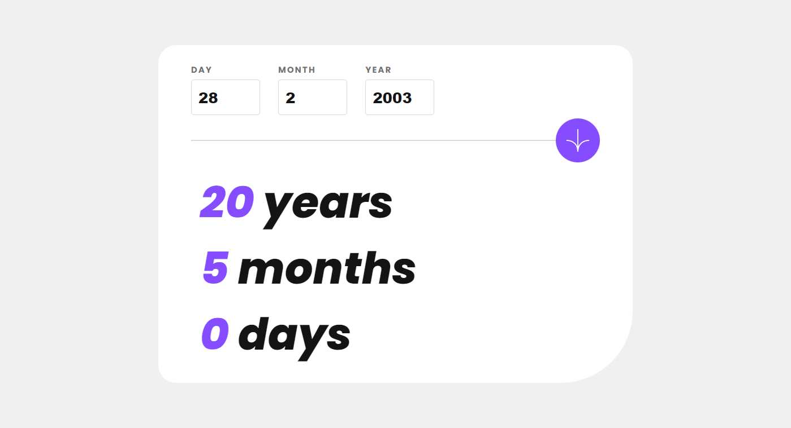

# Frontend Mentor - Age calculator app solution

This is a solution to the [Age calculator app challenge on Frontend Mentor](https://www.frontendmentor.io/challenges/age-calculator-app-dF9DFFpj-Q). Frontend Mentor challenges help you improve your coding skills by building realistic projects. 

## Table of contents

- [Overview](#overview)
  - [The challenge](#the-challenge)
  - [Screenshot](#screenshot)
  - [Links](#links)
- [My process](#my-process)
  - [Built with](#built-with)
  - [What I learned](#what-i-learned)
  - [Continued development](#continued-development)
  - [Useful resources](#useful-resources)
- [Author](#author)

## Overview

### The challenge

Users should be able to:

- View an age in years, months, and days after insert a valid date through the form
- Receive validation errors if:
  - The year is in the future
- View the optimal layout for the interface depending on their device's screen size
- See hover and focus states for all interactive elements on the page

### Screenshot



### Links

- Solution URL: [Solution](https://your-solution-url.com)
- Live Site URL: [Age Calculator 2077](https://your-live-site-url.com)

## My process

### Built with

- Semantic HTML5 markup
- CSS custom properties
- Flexbox
- Mobile-first workflow
- [React](https://reactjs.org/) - JS library
- [Next.js](https://nextjs.org/) - React framework
- [Sass](https://sass-lang.com/) - For styles

### What I learned

In need to create a logic to calculate the age, I took approximated values in milliseconds for a year, month and day. This part of the code looks cool, though.

```js
useEffect(() => {
  // Logic to calculate age
  const ageInMs = Date.now().valueOf() - inputDate.valueOf();

  if (ageInMs > 0) {
    // Division to calculate the integer number of YEARS from milliseconds
    setAgeYears(Math.floor(ageInMs / 31556926000));
    // Division to calculate the integer number of MONTHS from the rest in milliseconds of years operation
    setAgeMonths(Math.floor((ageInMs % 31556926000) / 2629743833.3));
    // Division to calculate the integer number of DAYS from the rest in milliseconds of months operation
    setAgeDays(Math.floor(((ageInMs % 31556926000) % 2629743833.3) / 86400000));
  } else {
    setAgeYears(NaN);
    setAgeMonths(NaN);
    setAgeDays(NaN);
  }
}, [inputDate]);
```

Another piece of code that I'm proud of is this one, that I "translated" an algorithm that I've found to TS. This is for the input validation in case of different months and leap years.

```js
function getMaximumDays() {
  const monthsWith31 = [0, 2, 4, 6, 7, 9, 11];
  const monthsWith30 = [3, 5, 8, 10];
  let maximumDays;

  // Verification for the max value for day input according to the current month
  if (monthsWith31.includes(month - 1))
    maximumDays = 31;
  else if (monthsWith30.includes(month - 1))
    maximumDays = 30;
  else { /* Verification if it is a leap year */
    if (year % 4 === 0) {
      if (year % 100 === 0) {
        if (year % 400 === 0) {
          maximumDays = 29;
        } else
          maximumDays = 28;
      } else
        maximumDays = 29;
    } else
      maximumDays = 28;
  }

  return maximumDays;
}
```

### Continued development

In the next challenge I intend to use styled-components for styling and, maybe, App Router API in Next.js.

### Useful resources

- [How to disable arrows from number input](https://www.geeksforgeeks.org/how-to-disable-arrows-from-number-input/)
- [Avoid enter dot in input field](https://stackoverflow.com/questions/70303820/avoid-enter-dot-in-input-field)
- [Context placement in the code](https://github.com/vercel/next.js/discussions/14788)
- [Year, month and day in ms](https://www.advancedconverter.com/unit-conversions/time-conversion/years-to-milliseconds)
- [Spinner animations](https://blog.logrocket.com/spinners-notifications-react-app/#adding-modern-spinners-react-spinners)
- [Selection in CSS](https://www.w3schools.com/howto/howto_css_text_selection.asp)
- [Determination of a leap year](https://learn.microsoft.com/en-us/office/troubleshoot/excel/determine-a-leap-year)

## Author

- Frontend Mentor - [@santosesantos](https://www.frontendmentor.io/profile/santosesantos)
